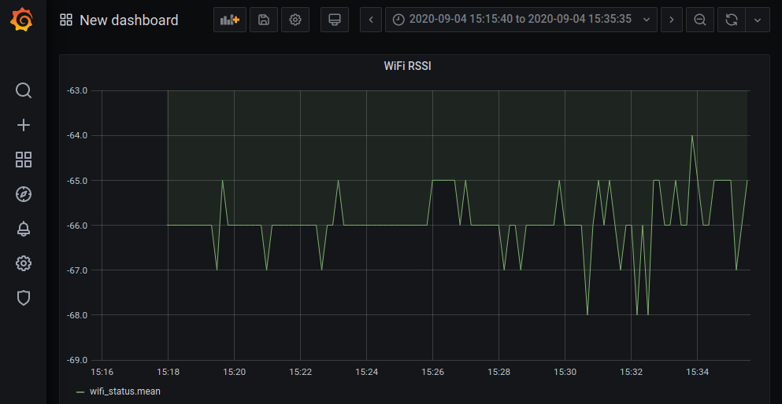
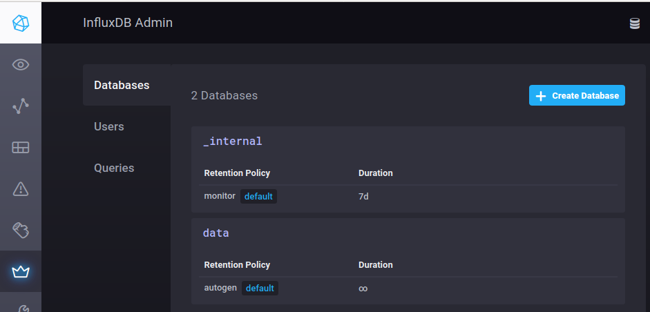
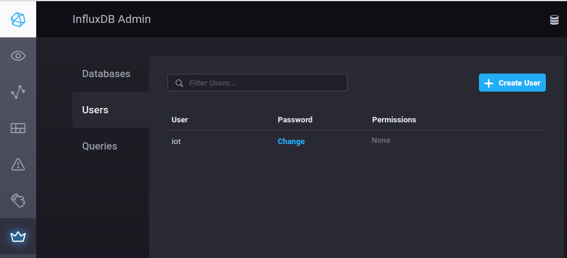
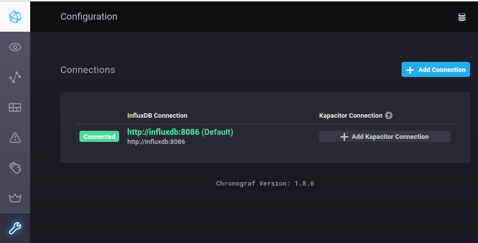
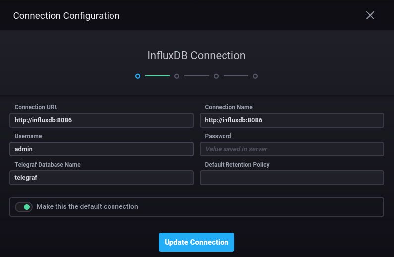
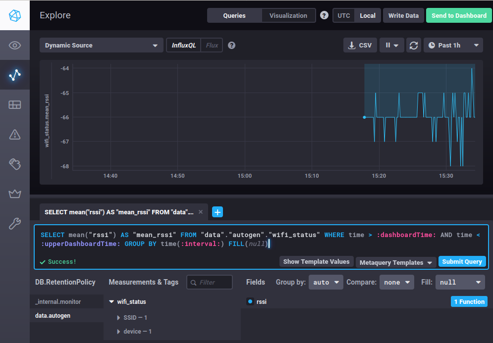
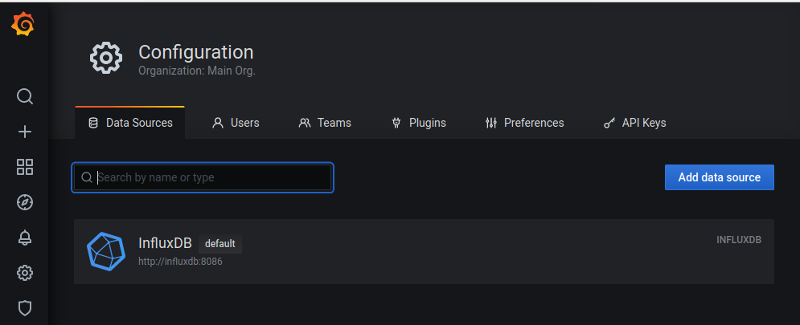
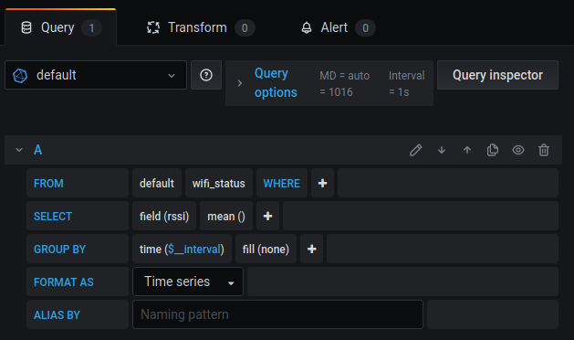

# Docker InfluxDB1 - Grafana (HTTP)

In this tutorial we're creating a Grafana Dashboard to visualize the ESP8266 or ESP32 signal strength of the WiFi connection with the base station:



**Prerequisites**

* WiFi network.
* Web browser.
* Arduino IDE (Make sure ESP2866 is correctly installed via the boards manager)
* Arduino `ESP8266_Influxdb` library v3.3.0.
* ESP8266 v2.7.4. (No other specific hardware required)
* Docker and Docker-compose to install:
  * InfluxDB v1.8.2 (Database)
  * Chronograf v1.8.2 (InfluxDB Backend)
  * Grafana v7.1.5 (Dasboards)

## Installation Linux

This installation has been tested on Ubuntu 18.04.

### Install

Install required packages:

```bash
sudo apt update
sudo apt install docker.io docker-compose
```

### Status

Get Docker status:

```bash
systemctl status docker
```

### Enable/disable on system startup

It is recommended to run Docker at system setup with the command:

```bash
systemctl enable docker
```

### Run docker without root privileges

To run Docker commands as normal user:

```bash
sudo usermod -aG docker $(whoami)
# Reboot system
```

## Docker Configuration

Edit environment variables in the hidden `.env` file:

```bash
# Volume directory (relative to this directory):
VOLUME_DIR=./volumes

# InfluxDB admin credentials
INFLUXDB_ADMIN_USER=admin
INFLUXDB_ADMIN_PASSWORD=admin123

# Chronograf admin credentials
CHRONOGRAF_USERNAME=admin
CHRONOGRAF_PASSWORD=admin123
```

## Run Docker

Create and run containers:

```bash
docker-compose up
```

## Configure InfluxDB1

Open a webbrowser: http://localhost:8888

### InfluxDB Admin

**Databases**

Click `Create Database` : 

* Database name: `data`



**Users**

Click `Create User`:

* Username: `iot`
* Password: `iot123`



### Configuration

Check configuration `http://influxdb:8086 (Default)`:

* Connection URL: http://influxdb:8086
* Connection Name: http://influxdb:8086
* Username: `admin`
* Password: `admin123`
* Telegraf Database Name: `telegraf`






## Flash ESP8266 / ESP32

Open example with Arduino IDE: `InfluxDB1_HTTP_WiFi_RSSI.ino`.

Configure macro's:

```C++
// Device name
#define DEVICE "ESP8266"

// WiFi connection
#define WIFI_SSID "wifi"
#define WIFI_PASSWORD "password"

// InfluxDB connection
#define INFLUXDB_URL "http://192.168.0.1:8086"
#define INFLUXDB_USER "iot"
#define INFLUXDB_PASSWORD "iot123"
#define INFLUXDB_DB_NAME "data"
```

Write to ESP8266 or EPS32 board. Serial output:

```
InfluxDB1 ESP8266/ESP32 WiFi RSSI example
Connecting to wifi.....OK
Connected to InfluxDB: http://192.168.0.1:8086
Writing: wifi_status,device=ESP8266,SSID=wifi rssi=-66i
Wait 10s
Writing: wifi_status,device=ESP8266,SSID=wifi rssi=-67i
Wait 10s
...
```

## InfluxDB Explore data

Uploaded data can be visualized in the Explore menus with settings displayed in the screenshot below:



## Configure Grafana

Open a web browser: 

* http://localhost:3000
* Username: `admin`
* Password: `admin`

**Create Datasource**

Configuration | Datasources: Add data source: `InfluxDB`:

* URL: http://influxdb:8086
* Database: `data`
* User: `iot`
* Password: `iot123`



Save settings:


**Create Dashboard**

Create | Dashboard: Add new panel:

* FROM: `default`, `wifi_status`
* SELECT: `field(rssi)`, `mean()`
* GROUP BY: `time($__interval)`, `fill(none)`

Panel | Settings | Panel title: `WiFi RSSI`.

Click `Apply` to save panel.



## Done

Congratulations! Now the data can be visualized!