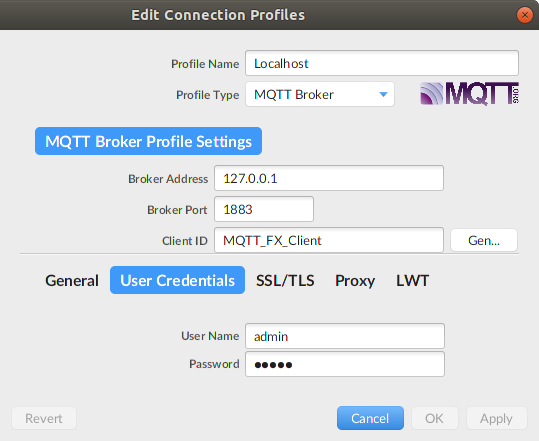
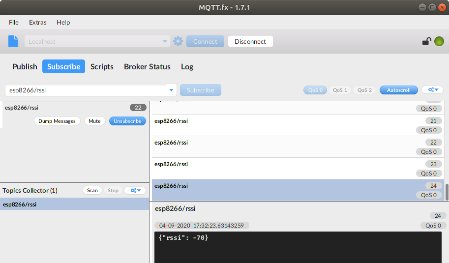

# Docker MQTT Mosquitto - ESP8266 / ESP32

This project contains MQTT Mosquitto in a Docker container.

**Prerequisites**

* WiFi network.
* Docker and Docker-compose to install:
  * Mosquitto
* ESP8266 v2.7.4 or ESP32 board. (No other specific hardware required)
* Arduino `PubSubClient` library v2.8.0.
* MQTT client for testing.

## Installation Linux

This installation has been tested on Ubuntu 18.04.

Run Mosquitto in Docker container:

```bash
# Create MQTT user
mosquitto_passwd -c config/mosquitto/data/passwd <username>

# passwd file already contains: admin:admin

# Mosquitto Docker setup
./setup.sh

# Run Docker
docker-compose up
```

## Arduino PubSubClient example

Open `MQTT_Publish_WiFi_RSSI.ino` with the Arduino IDE and configure the configuration macro's:

```c++
// WiFi connection
#define WIFI_SSID "***"
#define WIFI_PASSWORD "***"

// MQTT connection
#define MQTT_SERVER             "192.168.0.1"
#define MQTT_USER               "admin"
#define MQTT_PASSWORD           "admin"

// MQTT topics
#define MQTT_TOPIC_RSSI         "esp8266/rssi"
#define MQTT_CLIENT_ID          "ESP8266"
#define MQTT_PUBLISH_DELAY_SEC  30
```

### Install  MQTT.fx client

Download and install https://mqttfx.jensd.de/index.php/download

Create connection:



Subscribe to topic `esp866/rssi`:

